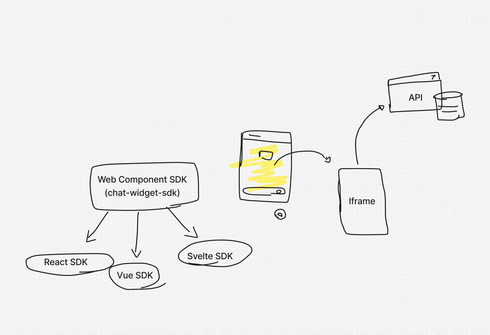
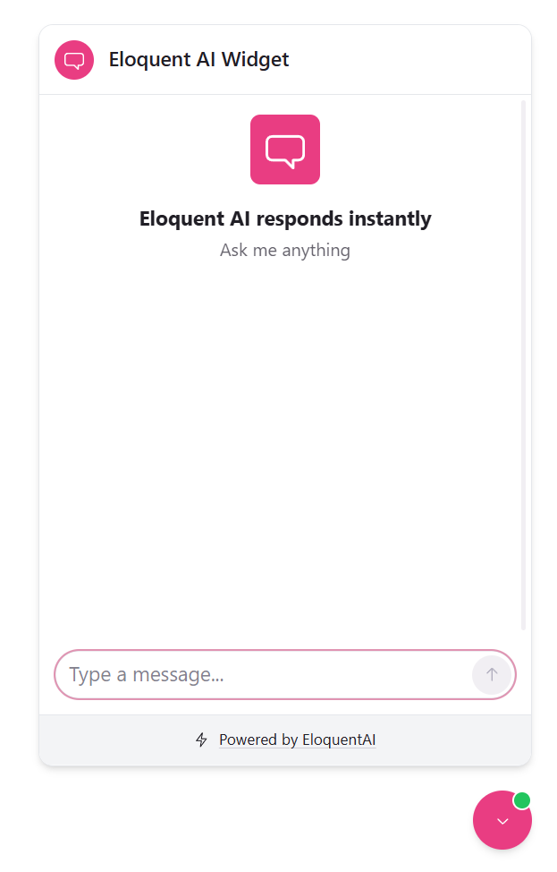
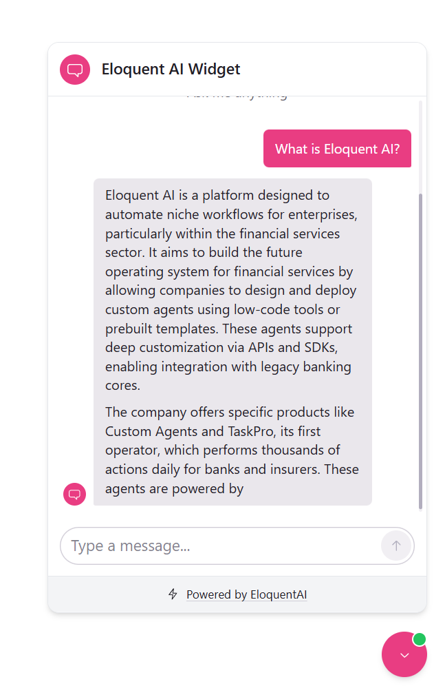

# Embeddable Chat Widget

## Architecture

The primary goal of this project was to develop a framework-agnostic implementation of the chat widget, using modern technologies and practices to develop it, that could be easily embedded into any web application.

To enable more efficient, secure, and rapid iteration, the widget is loaded within an iframe. This isolation provides enhanced control over the deployment process and allows for swift resolution of any issues, which ultimately informed the design of this architecture.



### Screenshots

<div style="display: flex; justify-content: space-around; align-items: flex-start;">
  
  
</div>

### Challenges

The primary challenge involved encapsulating the widget SDK within a web component without style leakage or unintended impact on the host page.

This required workarounds, such as loading styles inline within the component and subsequently appending them as `<style>` tags inside the Shadow DOM.

Furthermore, integrating an iframe introduced complexity regarding bidirectional communication between the host page and the iframe.

### Components

1.  **Chat Widget SDK (`packages/chat-widget-sdk`)**

    - **Role**: The entry point for the host application.
    - **Tech**: React, wrapped as a Web Component using `@r2wc/react-to-web-component`.
    - **Function**: It injects a custom element (`<chat-widget>`) into the DOM, which renders an `<iframe>`. This ensures complete style isolation from the host page. It handles communication between the host and the widget via `postMessage`.
    - **Note**: While the core SDK is implemented as a Web Component for framework agnosticism, it includes a React wrapper (`chat-widget-sdk-react`) for seamless integration. Similar wrappers can be easily created for other frameworks like Vue, Angular, or Svelte.

2.  **Widget Application (`apps/widget`)**

    - **Role**: The user interface of the chat widget.
    - **Tech**: React, Vite, Radix UI, Tailwind CSS, Framer Motion.
    - **Function**: Runs inside the iframe injected by the SDK. It provides the chat interface, handles user interactions, and communicates with the API.

3.  **API Service (`services/api`)**
    - **Role**: The backend service handling chat logic.
    - **Tech**: Node.js, Express, LangChain, Google Gemini.
    - **Function**: Processes chat messages, performs RAG (Retrieval-Augmented Generation) using an in-memory vector store, and streams responses back to the widget.

### Strengths

- **Framework Agnostic and Embeddability**: The SDK exposes a standard Web Component, allowing it to be used in any web application (React, Vue, Angular, vanilla HTML/JS).
- **Monorepo Structure**: Built with Nx, allowing shared types and utilities between the SDK, Widget, and API.
- **Isolation**: The widget operates within an iframe, ensuring complete separation from the host page. This isolation facilitates independent deployments and updates, allowing us to seamlessly roll out new versions or fixes without impacting third-party applications or requiring them to update their integration code.
- **Style Isolation**: Using an iframe guarantees that the widget's styles (Tailwind/Radix) do not bleed into the host page, and vice-versa.

### Weaknesses

- **Iframe Overhead**: Loading a full React application inside an iframe incurs a slight performance cost compared to a direct DOM injection.
- **Communication Complexity**: Interacting between the host page and the widget requires a `postMessage` bridge, which adds complexity to event handling.
- **Project Structure**: While monorepos can introduce navigational complexity, the implemented architecture effectively facilitates extensive code sharing across the SDK, Widget, and API, thereby leveraging the structure's benefits.

## Installation and Running

Follow these steps to install and run the project components.

### 1. Run the SDK Build + Watch

To build the SDK and watch for changes:

```bash
npx nx build chat-widget-sdk --watch
```

### 2. Run the Widget Server

To start the widget development server:

```bash
npx nx serve widget
```

### 3. Run the API Server

To start the API server:

```bash
npx nx serve @eloquentai/api
```

### 4. Run the Demo Application

To start the demo application:

```bash
npx nx serve demo
```

## SDK Linking

Follow these steps to build the `chat-widget-sdk` and link it locally to another project.

### 1. Build the SDK

First, build the SDK:

```bash
npx nx build chat-widget-sdk
```

### 2. Link the SDK

Navigate to the output directory and create a symlink:

```bash
cd dist/packages/chat-widget-sdk
npm link
```

In your other project (where you want to use the SDK), run:

```bash
npm link @eloquentai/chat-widget-sdk
```

### 3. Run the Servers

Ensure the backend services are running to support the SDK:

**Run the Widget Server:**

```bash
npx nx serve widget
```

```bash
npx nx serve @eloquentai/api
```

## Usage

After linking the SDK, you can use it in your project as follows:

```javascript
import { setupChatWidget } from '@eloquentai/chat-widget-sdk';

/**
 * Calling this method, will prepend a ChatWidget Web Component to the DOM.
 */
setupChatWidget({
  id: 'your-widget-id',
  title: 'Chat Widget',
  accentColor: '#007bff',
  secondaryColor: '#6c757d',
  logoUrl: 'https://example.com/logo.png',
});
```
